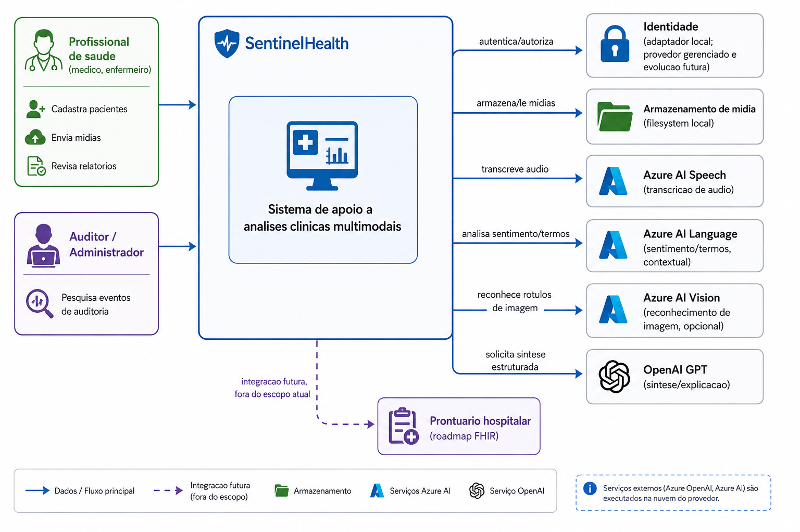

# SentinelHealth

[](https://www.python.org/downloads/)
[](https://fastapi.tiangolo.com/)
[](https://www.sqlalchemy.org/)
[](https://www.postgresql.org/)
[](https://react.dev/)
[](https://www.typescriptlang.org/)
[](https://vitejs.dev/)
[](https://docs.docker.com/compose/)
[](https://azure.microsoft.com/products/ai-services)
[](https://platform.openai.com/)
[](https://docs.pytest.org/)
[](https://vitest.dev/)

Sistema de apoio a análises clínicas com inteligência artificial
multimodal (áudio, vídeo, imagem e texto). **Não realiza diagnóstico
autônomo**: o risco clínico é sempre calculado por um motor de regras
determinístico e versionado — modelos de IA produzem apenas observações
e hipóteses, sujeitas a revisão profissional antes de qualquer relatório
se tornar definitivo.

Projeto desenvolvido para o **Tech Challenge — Fase 4** (FIAP).

> **Entrega:** Pós-Graduação **IA para Devs — FIAP / Fase 4** — Fernanda Valdevino e Marcos Vinício.

---

## Sumário

1. [Contexto do projeto](#1-contexto-do-projeto)
2. [Estado atual](#2-estado-atual)
3. [Estrutura do projeto](#3-estrutura-do-projeto)
4. [Tecnologias utilizadas](#4-tecnologias-utilizadas)
5. [Desenho de arquitetura](#5-desenho-de-arquitetura)
6. [Versões das bibliotecas](#6-versões-das-bibliotecas)
7. [Como rodar o projeto](#7-como-rodar-o-projeto)
8. [Manual de uso do sistema](#8-manual-de-uso-do-sistema)
9. [Análises disponíveis](#9-análises-disponíveis)
10. [Comandos principais (`make`)](#10-comandos-principais-make)
11. [Testes e verificação](#11-testes-e-verificação)
12. [Solução de problemas comuns](#12-solução-de-problemas-comuns)
13. [Documentação completa](#13-documentação-completa)
14. [Segurança e dados](#14-segurança-e-dados)

---

## 1. Contexto do projeto

Profissionais de saúde frequentemente precisam correlacionar sinais de
diferentes naturezas — um vídeo de uma sessão de fisioterapia, o áudio
de uma consulta, uma imagem clínica, dados vitais estruturados — para
formar uma avaliação de risco. O SentinelHealth automatiza a **coleta e
o pré-processamento** desses dados multimodais, aplica um **motor de
regras clínicas determinístico** sobre os dados estruturados, e organiza
tudo em um relatório único, revisável, antes de se tornar um documento
clínico definitivo.

O projeto nasceu como desafio acadêmico (Tech Challenge Fase 4) com um
requisito explícito: **usar inteligência artificial multimodal para
apoiar, nunca substituir, a decisão clínica**. Essa restrição é
estrutural no código, não apenas discursiva — ver a seção
[Análises disponíveis](#9-análises-disponíveis) para o detalhamento de
onde a IA entra (observações, hipóteses, sínteses textuais) e onde ela
explicitamente **não** entra (o cálculo do nível de risco).

Escopo completo do produto (personas, casos de uso, exclusões
deliberadas, decisões de privacidade): [`docs/ESCOPO_PROJETO.md`](docs/ESCOPO_PROJETO.md).

---

## 2. Estado atual

O sistema está funcional de ponta a ponta em ambiente de desenvolvimento:
cadastro de pacientes e unidades assistenciais, upload multimodal (áudio,
vídeo, imagem, texto), motor de regras clínicas versionado, orquestrador
que processa cada análise por modalidade, consolidação de risco (com LLM
opcional), geração de laudo em PDF, auditoria imutável e controle de
acesso (identidade local para dev/testes).

As nuvens gerenciadas utilizadas são o **Azure Cognitive Services**
(Speech to Text, Language, Vision) e o **Azure Health Data Services**
(armazenamento DICOM de imagens médicas) — os adaptadores reais (Azure +
OpenAI para o LLM de consolidação) são plugáveis e começam **desligados
por padrão**: a aplicação roda 100% local, sem nenhuma credencial
externa. O worker de vídeo (OpenPose + YOLOv8) é self-hosted, não um
serviço de nuvem gerenciado — ver
[ADR 0016](docs/adr/0016-avaliacao-componentes-aws-gerenciados.md) para o
porquê.

O **GPT-4 Vision** (OpenAI) roda a análise contextual clínica de imagem e
vídeo (expressão, postura, sequência de eventos) de forma **independente**
da feature flag do LLM de consolidação — basta `OPENAI_API_KEY`
configurada no `.env`, sem precisar ligar nenhuma flag adicional.

Gap conhecido e documentado: o fluxo é **assíncrono via fila** (análise
sob demanda), não monitoramento contínuo em tempo real — decisão de
escopo registrada em [`ESCOPO_PROJETO.md`](docs/ESCOPO_PROJETO.md) seção
1. Esse e outros gaps estão listados de forma explícita, nunca
escondidos, em [`docs/governance/VALIDACAO_ESCOPO.md`](docs/governance/VALIDACAO_ESCOPO.md).

---

## 3. Estrutura do projeto

```text
backend/     API FastAPI + workers (Python, uv, SQLAlchemy, Alembic)
frontend/    SPA React + TypeScript + Vite
docs/        Documentação, escopo, ADRs e diagramas de arquitetura
compose.yaml Orquestração local (Postgres, backend, worker, frontend)
Makefile     Interface única de comandos (também usada pelo CI/CD)
```

Detalhamento completo (árvore de pastas de cada camada, onde encontrar
cada módulo): [`docs/ESTRUTURA_PROJETO.md`](docs/ESTRUTURA_PROJETO.md).

---

## 4. Tecnologias utilizadas

| Camada | Tecnologia principal |
| --- | --- |
| Backend | Python 3.11–3.12, FastAPI, SQLAlchemy, Alembic, Pydantic |
| Frontend | React 18, TypeScript, Vite, TanStack Query |
| Banco de dados | PostgreSQL 16 |
| Fila de processamento | Tabela PostgreSQL (`SELECT ... FOR UPDATE SKIP LOCKED`) |
| Armazenamento de mídia | Filesystem local, atrás de URL pré-assinada |
| Nuvem gerenciada | Azure Cognitive Services (Speech, Language, Vision) + Azure Health Data Services (DICOM) |
| LLM | OpenAI (opcional) ou template determinístico local |
| Visão contextual de imagem/vídeo | GPT-4 Vision (OpenAI), independente da flag de LLM |
| Visão computacional de vídeo | OpenPose + YOLOv8, worker self-hosted em CPU |
| Imagens médicas (DICOM) | pydicom + Azure Health Data Services (opcional) |
| Testes | Pytest (backend), Vitest (frontend) |
| Containerização | Docker + Docker Compose |
| Gerenciador de pacotes | `uv` (backend), `npm` (frontend) |

Ver a lista completa e as versões exatas em
[`docs/BIBLIOTECAS.md`](docs/BIBLIOTECAS.md).

---

## 5. Desenho de arquitetura

O SentinelHealth é um **monólito modular**: uma única API FastAPI expõe
todos os módulos de domínio, e um worker separado processa análises
multimodais de forma assíncrona via fila. Toda integração externa (LLM,
transcrição, visão, storage) é um adaptador plugável, com um modo
`LOCAL` honesto (nunca inventa resultado) e um modo real — a troca é por
configuração, nunca por código espalhado.



Diagrama de contexto completo, diagrama de containers, sequência do
fluxo multimodal ponta a ponta, módulos do backend/frontend e a lista de
ADRs (decisões arquiteturais): [`docs/ARQUITETURA.md`](docs/ARQUITETURA.md).

Diagramas adicionais em PNG (autenticação, upload seguro, auditoria,
modelo ER, fluxo de dados pessoais/RIPD), cada um com a fonte Mermaid
`.mmd` correspondente para edição: [`docs/architecture/`](docs/architecture/).

---

## 6. Versões das bibliotecas

Resumo rápido (versões exatas travadas nos lockfiles):

| Camada | Runtime | Principais bibliotecas |
| --- | --- | --- |
| Backend | Python 3.11–3.12 | FastAPI 0.139, SQLAlchemy 2.0.51, Pydantic 2.13, Alembic 1.18, OpenAI SDK 2.45 |
| Frontend | Node.js 22+ | React 18.3.1, TanStack Query 5.101, React Router 6.30, Vite 5.4 |
| Banco de dados | — | PostgreSQL 16 |

Tabela completa por camada (produção e desenvolvimento, com toda
biblioteca e sua versão exata resolvida no lockfile):
[`docs/BIBLIOTECAS.md`](docs/BIBLIOTECAS.md).

---

## 7. Como rodar o projeto

### 7.1 Setup rápido (quem já tem os pré-requisitos instalados)

```bash
make setup       # instala dependencias de backend e frontend, cria .env
make compose-up  # sobe o PostgreSQL local
cd backend  && uv run alembic upgrade head   # aplica a migration inicial
cd backend  && uv run uvicorn app.main:app --reload   # API em :8000
cd frontend && npm run dev                             # SPA em :5173
```

Ou, de forma resumida:

```bash
make setup
make dev
```

Acesse `http://localhost:5173` — a página inicial confirma a conexão com
`GET /health` da API. A documentação interativa da API (Swagger UI) fica
em `http://localhost:8000/docs` — ver seção 7.5 abaixo para detalhes e
outras formas de consultar o contrato.

### 7.2 Guia completo, passo a passo, por sistema operacional

O guia acima assume pré-requisitos já instalados. Para o passo a passo
**extremamente detalhado**, cobrindo a instalação de cada pré-requisito
em **Windows, macOS e Linux**, camada por camada (banco → backend → API →
worker → frontend), com solução de problemas específica de cada sistema:
[`docs/COMO_RODAR.md`](docs/COMO_RODAR.md).

### 7.3 Primeira execução completa (dados de demonstração)

Depois de subir o sistema, siga
[`docs/MANUAL_EXECUCAO.md`](docs/MANUAL_EXECUCAO.md) para: carregar e
publicar as regras clínicas, criar usuários de desenvolvimento, e rodar
o fluxo ponta a ponta (paciente → análise → revisão → laudo em PDF).

### 7.4 Configurar integrações reais (Azure, OpenAI, visão computacional)

Por padrão, tudo roda com adaptadores locais, sem nenhuma credencial
externa. Para ligar Azure AI Speech/Language/Vision, Azure Health Data
Services (DICOM), OpenAI (LLM + GPT-4 Vision) ou a visão computacional
real de vídeo (OpenPose/YOLOv8):
[`docs/MANUAL_INSTALACAO.md`](docs/MANUAL_INSTALACAO.md). Use
`make check-env` para verificar rapidamente quais integrações já estão
configuradas no `.env` atual.

### 7.5 Documentação interativa da API (Swagger / OpenAPI)

A API expõe o contrato OpenAPI automaticamente via FastAPI, sem
configuração adicional — basta a API estar rodando (seção 7.1):

| URL | Conteúdo |
| --- | --- |
| `http://localhost:8000/docs` | **Swagger UI** — explorar e testar cada endpoint interativamente (inclui o botão "Authorize" para preencher o header `X-Dev-Subject`) |
| `http://localhost:8000/redoc` | **ReDoc** — visualização alternativa, somente leitura, do mesmo contrato |
| `http://localhost:8000/openapi.json` | Schema OpenAPI 3.1 bruto, gerado em runtime a partir das rotas e schemas Pydantic atuais |

Além disso, um **snapshot versionado** do contrato fica em
[`docs/contracts/openapi.json`](docs/contracts/openapi.json) — permite
revisar diffs de contrato em pull requests sem precisar rodar a API.
Sempre que uma rota ou schema mudar, regenere o snapshot:

```bash
make export-openapi
```

Ver [`docs/contracts/README.md`](docs/contracts/README.md) para a
política de versionamento/compatibilidade do contrato.

---

## 8. Manual de uso do sistema

Guia tela a tela: sessão de desenvolvimento, cadastro de pacientes,
criação de análise multimodal, acompanhamento do processamento, revisão
do relatório, auditoria e administração (usuários, regras clínicas,
feature flags).

Manual completo: [`docs/MANUAL_USO.md`](docs/MANUAL_USO.md). Para o
passo a passo de como cada valor da **tela de revisão da análise** é
calculado (nível de risco, big numbers, termos clínicos, risco sugerido
por IA): [`docs/ANALISES_DISPONIVEIS.md`](docs/ANALISES_DISPONIVEIS.md)
seção 11.

---

## 9. Análises disponíveis

O que cada modalidade produz de fato, com os modelos/algoritmos
aplicados, exemplos reais de regras clínicas e um exemplo numérico
completo de detecção de anomalia:

| Análise | Resumo |
| --- | --- |
| Vídeo | OpenPose (pose articular) + YOLOv8 (detecção de objetos), self-hosted; GPT-4 Vision (análise contextual/sequência de eventos, opcional) |
| Áudio | DSP acústico determinístico (sempre ativo) + transcrição Azure AI Speech (opcional) |
| Imagem | Categorização heurística (sempre ativa) + reconhecimento Azure AI Vision (opcional) + GPT-4 Vision (análise contextual clínica, opcional) + DICOM (Azure Health Data Services, opcional) |
| Texto | Extração de termos clínicos com negação/temporalidade/certeza — motor determinístico NegEx/ConText (método primário) |
| Motor de regras | Único responsável pelo `risk_level` — determinístico, versionado, nunca influenciado por IA |
| Risco assistido por IA | `assisted_risk_level`, calculado pelo LLM a partir dos achados multimodais — sempre exibido como sugestão complementar, nunca substitui o `risk_level` determinístico |
| Detecção de anomalias | Séries temporais de sinais vitais, independente do motor de regras |

Detalhamento completo, com todos os modelos, thresholds e exemplos:
[`docs/ANALISES_DISPONIVEIS.md`](docs/ANALISES_DISPONIVEIS.md).

---

## 10. Comandos principais (`make`)

| Comando | Descrição |
| --- | --- |
| `make check-prereqs` | Verifica pré-requisitos instalados na máquina (Python, uv, Node, npm, Docker, Git, ffmpeg, Azure CLI) |
| `make setup` | Instala dependências (backend e frontend), cria `.env` |
| `make dev` | Sobe o Postgres via Compose e orienta a subir API/worker/frontend |
| `make up` | Sobe tudo via Docker Compose (Postgres + API + worker + frontend) |
| `make stop` | Derruba os containers do Compose |
| `make logs` | Exibe logs dos containers em tempo real |
| `make health` | Verifica se a API e o frontend estão respondendo |
| `make format` | Formata backend (ruff) e frontend (prettier) |
| `make lint` | Lint backend (ruff) e frontend (eslint) |
| `make typecheck` | Checagem de tipos backend (mypy) e frontend (tsc) |
| `make test` | Testes unitários de backend e frontend (backend usa `sentinelhealth_test`, ver `make test-db-create`) |
| `make test-integration` | Testes de integração (requer Postgres ativo) |
| `make test-db-create` | Cria o banco de teste `sentinelhealth_test` (idempotente, rode uma vez após `compose-up`) |
| `make test-db-migrate` | Aplica as migrations no banco de teste |
| `make load-test` | Roda um teste de carga (`scenario=health` por padrão) |
| `make build` | Build das imagens Docker |
| `make check` | Validação local equivalente ao gate de PR (lint+typecheck+test+regras) |
| `make migrate` | Aplica migrations pendentes |
| `make migration name="..."` | Cria uma nova migration Alembic |
| `make rules-validate` | Valida os arquivos YAML de regras clínicas contra o schema |
| `make rules-seed` | Carrega as regras clínicas no banco (idempotente) |
| `make seed-dev-data` | Cria instituição e usuários de desenvolvimento |
| `make seed-care-units` / `seed-employees` / `seed-patients` | Popula dados fictícios adicionais (idempotente) |
| `make worker` | Roda uma iteração do worker do orquestrador |
| `make worker-loop` | Roda o worker do orquestrador em loop contínuo |
| `make codegen` | Gera `frontend/src/types/enums.generated.ts` a partir dos enums Python |
| `make export-openapi` | Gera o snapshot `docs/contracts/openapi.json` |
| `make compose-up` / `make compose-down` | Sobe/derruba os serviços do Compose |
| `make check-env` | Verifica quais integrações reais estão configuradas (OpenAI, Azure Speech/Language/Vision/DICOM, YOLOv8, ffmpeg) |
| `make setup-azure` | Cria recursos Azure Cognitive Services via CLI (Speech, Language, Vision) |
| `make setup-yolo` | Instala o grupo de dependências `vision` (YOLOv8/ultralytics) |

---

## 11. Testes e verificação

```bash
make check              # lint + typecheck + testes unitarios + validação das regras
make test                # só os testes unitários (backend + frontend)
make test-integration    # testes de integração (Postgres precisa estar de pé)
```

Testes de integração usam `pytest.mark.skipif` e são pulados
automaticamente se o Postgres não estiver acessível. Os testes de
backend usam um **banco separado** do de desenvolvimento
(`sentinelhealth_test`) para nunca poluir as telas da aplicação com dados
de teste — rode `make test-db-create && make test-db-migrate` uma vez
após o primeiro `make compose-up`.

---

## 12. Solução de problemas comuns

**`uv sync` falha ao baixar o interpretador Python.**
Garanta acesso à rede ou instale localmente uma versão compatível (3.11
ou 3.12) e rode `uv python pin 3.11`.

**API não conecta ao Postgres.**
Confirme que `make compose-up` está rodando (`docker compose ps`) e que
`DATABASE_URL` no `.env` aponta para `localhost:5432` (fora de
containers) ou `postgres:5432` (dentro do compose).

**Frontend não encontra a API (`ERR_CONNECTION_REFUSED`).**
Verifique `VITE_API_BASE_URL` no `.env`/`.env.example` e se a API está
respondendo em `GET /health`.

**Análise fica parada em `QUEUED`/`PROCESSING`.**
O worker do orquestrador precisa estar rodando em loop contínuo — sem
ele, nenhuma modalidade é processada.

**Migration falha em banco já existente.**
As migrations são aditivas e idempotentes por design; se o banco local
ficou inconsistente durante desenvolvimento, use `make compose-down` para
remover o volume e recriar do zero com `make compose-up`.

Solução de problemas específica por sistema operacional (Windows/macOS/
Linux) e por integração (Azure/OpenAI/visão): ver as seções finais de
[`docs/COMO_RODAR.md`](docs/COMO_RODAR.md),
[`docs/MANUAL_EXECUCAO.md`](docs/MANUAL_EXECUCAO.md) e
[`docs/MANUAL_INSTALACAO.md`](docs/MANUAL_INSTALACAO.md).

---

## 13. Documentação completa

| Documento | Conteúdo |
| --- | --- |
| [`docs/ARQUITETURA.md`](docs/ARQUITETURA.md) | Contexto, containers, fluxo multimodal, módulos, ADRs |
| [`docs/ESTRUTURA_PROJETO.md`](docs/ESTRUTURA_PROJETO.md) | Árvore de pastas detalhada de cada camada |
| [`docs/BIBLIOTECAS.md`](docs/BIBLIOTECAS.md) | Versões exatas de todas as dependências, por camada |
| [`docs/COMO_RODAR.md`](docs/COMO_RODAR.md) | Instalação e execução passo a passo (Windows/macOS/Linux) |
| [`docs/MANUAL_EXECUCAO.md`](docs/MANUAL_EXECUCAO.md) | Primeira execução completa: seed, publicação de regras, demonstração ponta a ponta |
| [`docs/MANUAL_INSTALACAO.md`](docs/MANUAL_INSTALACAO.md) | Configuração de cada integração real (Azure, OpenAI, visão computacional) |
| [`docs/MANUAL_USO.md`](docs/MANUAL_USO.md) | Manual de uso do sistema, tela a tela |
| [`docs/MANUAL_CAMPOS.md`](docs/MANUAL_CAMPOS.md) | Campos, regras de validação e o que cada tela armazena |
| [`docs/ANALISES_DISPONIVEIS.md`](docs/ANALISES_DISPONIVEIS.md) | O que cada análise multimodal produz, em detalhe técnico |
| [`docs/DATASETS_RECOMENDADOS.md`](docs/DATASETS_RECOMENDADOS.md) | Onde encontrar datasets públicos de áudio, vídeo e imagem para testes |
| [`docs/ESCOPO_PROJETO.md`](docs/ESCOPO_PROJETO.md) | Escopo completo do produto |
| [`docs/ESPECIFICACAO_FRONTEND.md`](docs/ESPECIFICACAO_FRONTEND.md) | Telas, design system e contratos de frontend |
| [`docs/CLASSIFICACAO_DADOS_CLINICOS.md`](docs/CLASSIFICACAO_DADOS_CLINICOS.md) | Base de conhecimento clínica (referência preliminar) |
| [`docs/adr/`](docs/adr/) | Decisões arquiteturais (ADRs) individuais |
| [`docs/architecture/`](docs/architecture/) | Diagramas PNG adicionais (autenticação, auditoria, ER, RIPD), com fonte Mermaid `.mmd` |
| [`docs/governance/`](docs/governance/) | Plano de resposta a incidentes, validação de escopo |

---

## 14. Segurança e dados

Nenhum dado real de paciente deve ser usado neste repositório. Somente
dados sintéticos são permitidos fora de produção (ver
[`ESCOPO_PROJETO.md`](docs/ESCOPO_PROJETO.md) seção 8.2). Não commite
`.env`, chaves de API ou credenciais Azure/OpenAI — o `.gitignore` da
raiz já bloqueia esses arquivos (o `.venv`, `node_modules` e a mídia
local gerada em `backend/.local-media`), mas a revisão de PR também
verifica isso.
