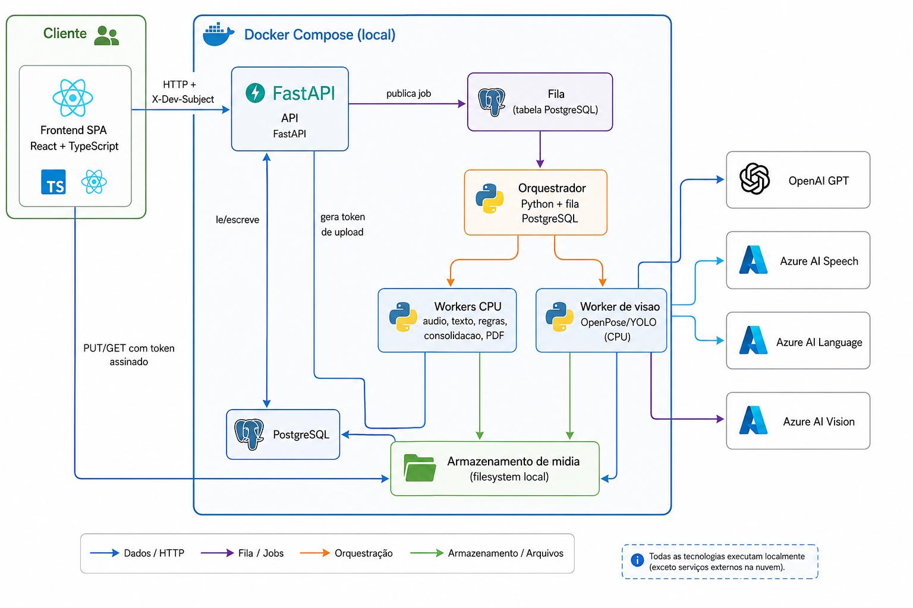
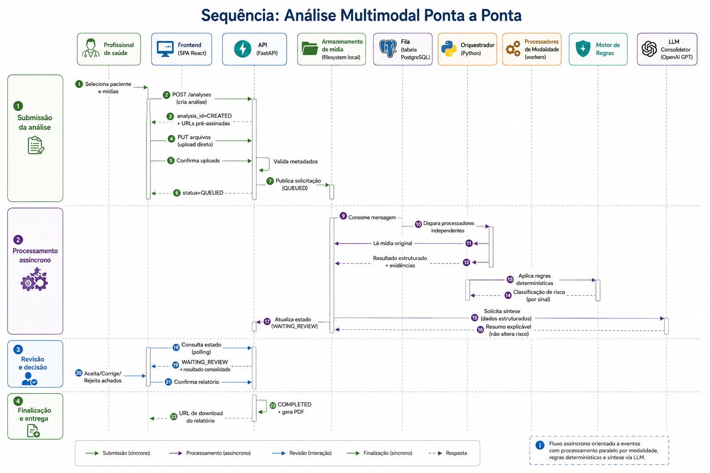
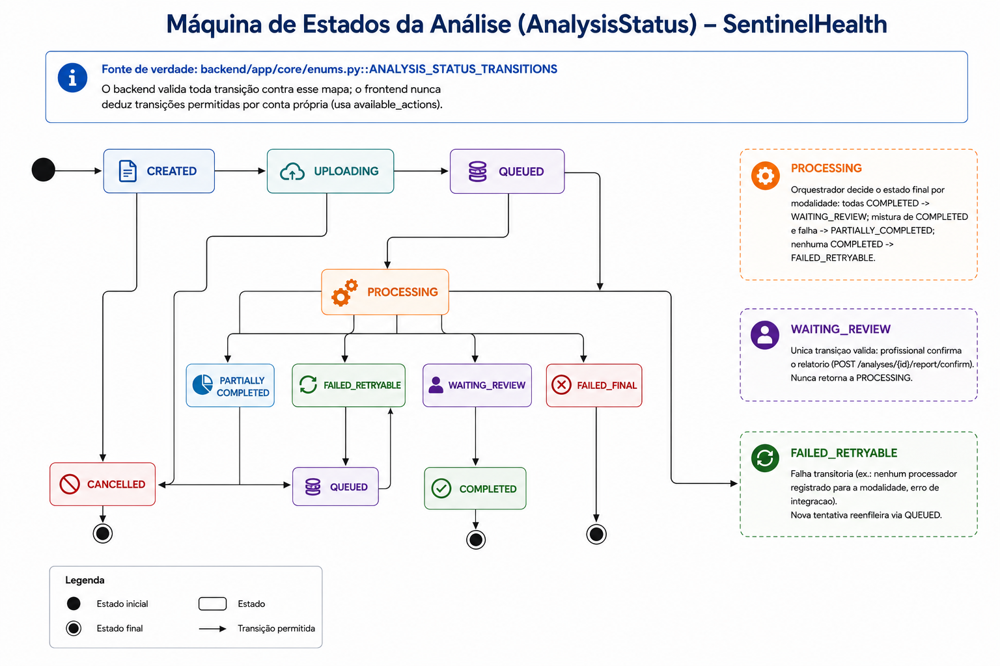

# Arquitetura — SentinelHealth

Este documento descreve a arquitetura do SentinelHealth: contexto,
containers, fluxo multimodal ponta a ponta e as decisões estruturais que
sustentam o desenho atual. Para decisões individuais detalhadas (por que
Postgres em vez de outro banco, por que orquestrador Python próprio em
vez de uma fila gerenciada, etc.), ver [`docs/adr/`](adr/).

---

## 1. Visão geral

O SentinelHealth é um **monólito modular** (ver
[ADR 0001](adr/0001-monolito-modular.md)): uma única API FastAPI expõe
todos os módulos de domínio (pacientes, análises, regras clínicas,
auditoria, identidade, administração), e um processo de worker separado
consome uma fila para processar análises multimodais de forma
assíncrona. Não há microsserviços — a decomposição em módulos ocorre no
nível de pacotes Python (`backend/app/<modulo>/`), não de processos ou
deploys independentes.

Princípios que orientam todas as decisões abaixo:

- **O risco clínico nunca vem de IA.** Só o motor de regras
  determinístico e versionado calcula `risk_level`. Modelos de IA
  (visão computacional, transcrição, LLM, análise de sentimento) só
  produzem observações e hipóteses — nunca substituem nem influenciam o
  cálculo de risco.
- **Adaptadores plugáveis, honestos por padrão.** Toda integração
  externa (LLM, transcrição, visão, análise de sentimento, storage,
  fila, identidade) é um `Protocol` do Python com pelo menos duas
  implementações: `LOCAL` (sem chamada de rede, nunca inventa um
  resultado — retorna "indisponível" explicitamente) e a real. A troca
  é feita por variável de ambiente e/ou feature flag em runtime, nunca
  por código espalhado pelo domínio.
- **Nenhum dado real de paciente.** Todo dado usado em desenvolvimento e
  testes é sintético (ver [`ESCOPO_PROJETO.md`](ESCOPO_PROJETO.md) seção
  8.2).

---

## 2. Diagrama de contexto (C4 nível 1)

Fonte editável (Mermaid): [`docs/architecture/01-contexto.mmd`](architecture/01-contexto.mmd).

A **única nuvem gerenciada** utilizada é o **Azure Cognitive Services**
(Speech, Language, Vision) — nenhum serviço AWS é usado no código nem na
infraestrutura (decisão registrada após reavaliação; ver ADRs 0003, 0004,
0006, 0007 e 0016, todos marcados como "Superado" com a justificativa da
migração). Identidade e armazenamento de mídia usam adaptadores locais
(cabeçalho de desenvolvimento `X-Dev-Subject` e filesystem,
respectivamente) — um provedor de identidade gerenciado e um blob
storage são evoluções futuras não implementadas hoje.

---

## 3. Diagrama de containers (C4 nível 2)

Fonte editável (Mermaid): [`docs/architecture/02-containers.mmd`](architecture/02-containers.mmd).

Na prática, hoje (`compose.yaml`), "Workers CPU" e "Worker de visão" são
o **mesmo processo** (`scripts.run_orchestrator_worker`, serviço
`worker`) — o diagrama separa por responsabilidade, não por deploy
físico atual. Um worker de visão dedicado (imagem Docker própria com
`ffmpeg`/OpenPose/YOLOv8) é uma evolução natural quando o volume de vídeo
justificar escalar esse processamento separadamente (ver seção 5.3 do
[`MANUAL_INSTALACAO.md`](MANUAL_INSTALACAO.md)).

---

## 4. Fluxo multimodal ponta a ponta (sequência)

Fonte editável (Mermaid): [`docs/architecture/04-sequencia-analise-multimodal.mmd`](architecture/04-sequencia-analise-multimodal.mmd).

O fluxo é **assíncrono via fila** por decisão de escopo (ver
[`ESCOPO_PROJETO.md`](ESCOPO_PROJETO.md) seção 1): a API nunca bloqueia a
requisição HTTP esperando o processamento multimodal terminar.
Monitoramento contínuo/alertas em tempo real (fora do fluxo de análise
sob demanda) ficam como evolução futura — ver a seção de detecção de
anomalias em séries temporais no
[`ANALISES_DISPONIVEIS.md`](ANALISES_DISPONIVEIS.md),
que já cobre esse caso de forma independente do motor de regras.

A tabela `ANALYSIS_STATUS_TRANSITIONS` (`backend/app/core/enums.py`) é a
fonte única de verdade dos estados e das transições válidas — o backend
valida toda mudança de estado contra esse mapa, e o frontend nunca deduz
transições permitidas por conta própria:

Fonte editável (Mermaid): [`docs/architecture/10-maquina-estados-analise.mmd`](architecture/10-maquina-estados-analise.mmd).

Diagramas adicionais (fluxo de autenticação, upload seguro, auditoria,
modelo ER de dados e fluxo de dados pessoais/RIPD) estão em
[`docs/architecture/`](architecture/) como arquivos PNG, cada um com a
fonte Mermaid `.mmd` correspondente para edição.

---

## 5. Módulos do backend

O backend (`backend/app/`) é organizado por domínio, um pacote Python por
módulo. Nenhum módulo acessa o banco de outro diretamente fora de
consultas explícitas de leitura — a orquestração entre módulos acontece
nas rotas da API ou no worker.

| Módulo | Responsabilidade |
| --- | --- |
| `core/` | Configuração (`Settings`), enums canônicos, segurança/RBAC, rate limiting, erros da API |
| `identity/` | Usuários, papéis e resolução de sessão (adaptador local `X-Dev-Subject`) |
| `patients/` | Cadastro de pacientes |
| `observations/` | Registro de observações clínicas (sinais vitais) e validação de qualidade da leitura |
| `anomaly_detection/` | Alertas de anomalia em série temporal (baseline/desvio-padrão e variação abrupta), independente do motor de regras |
| `media/` | Upload de mídia (URL pré-assinada), análises e seus estados |
| `processors/` | Processadores por modalidade (áudio, vídeo, imagem, texto) — geram achados tipados |
| `acoustics/` | Análise acústica DSP determinística sobre áudio (sem nuvem) |
| `clinical_nlp/` | Extração de termos clínicos com negação/temporalidade/certeza (NegEx/ConText) |
| `vision/` | Categorização heurística de imagem e guardrail de relevância clínica de rótulos |
| `integrations/` | Adaptadores plugáveis: LLM, transcrição, visão computacional, reconhecimento de imagem, análise de sentimento, storage, fila |
| `rules_engine/` | Interpretador de expressões seguro e avaliação de regras clínicas versionadas |
| `risk_consolidation/` | Combina avaliações de regra + solicita síntese ao LLM (nunca decide risco) |
| `clinical_support/` | Apoio a análise clínica assistido por LLM (paciente e por análise), sempre sob demanda |
| `reports/` | Composição do conteúdo estruturado do relatório e geração de PDF |
| `review/` | Fluxo de revisão profissional (aceitar/corrigir/rejeitar achados, confirmar relatório) |
| `orchestrator/` | Máquina de estados da análise e worker que consome a fila |
| `feature_flags/` | Toggles em runtime (banco de dados) para ligar integrações reais |
| `administration/` | CRUD de especialidades, funcionários, unidades assistenciais, usuários |
| `audit/` | Trilha de auditoria append-only com cadeia de hash verificável |
| `api/` | Rotas FastAPI e schemas Pydantic (contratos HTTP) |

`clinical_rules/` (fora de `app/`) contém os arquivos YAML versionados
das regras clínicas e a CLI de validação/seed — deliberadamente separado
do runtime da API porque é conteúdo clínico revisado por processo
próprio (ver [ADR 0011](adr/0011-formato-regras-clinicas.md)).

---

## 6. Módulos do frontend

O frontend (`frontend/src/`) segue a mesma lógica de features + camadas
compartilhadas:

| Diretório | Conteúdo |
| --- | --- |
| `app/` | Router, guarda de permissões por papel (`RequireRole`), providers globais, layout (`AppShell`, sidebar, topbar) |
| `features/` | Uma pasta por área de produto: `patients`, `analyses`, `audit`, `admin`, `dashboard`, `auth`, `dev` |
| `components/ui/` | Componentes de design system (badges, botões, tabelas) reutilizados entre features |
| `components/data-display/`, `components/feedback/`, `components/forms/`, `components/layout/` | Componentes compartilhados por categoria |
| `services/api/` | Um módulo por recurso da API (`patients.ts`, `analyses.ts`, `administration.ts`, etc.) — única camada que conhece os endpoints HTTP |
| `services/uploads/` | Upload direto ao storage via URL pré-assinada |
| `hooks/` | Hooks compartilhados (sessão de desenvolvimento, debounce, usuário atual) |
| `types/` | Tipos TypeScript espelhando os schemas Pydantic do backend; `enums.generated.ts` é gerado automaticamente (`make codegen`) — nunca editado manualmente |

Ver [`docs/ESPECIFICACAO_FRONTEND.md`](ESPECIFICACAO_FRONTEND.md) para o
design system completo (cores, tipografia, espaçamento) e a especificação
tela a tela.

---

## 7. Persistência e fila

- **Banco de dados:** PostgreSQL único, fonte de verdade de todo o
  domínio (ver [ADR 0002](adr/0002-postgresql-fonte-de-verdade.md)).
  Migrations gerenciadas por Alembic, sempre aditivas.
- **Fila de processamento:** implementada como uma tabela PostgreSQL
  (`analysis_queue_messages`), consumida com
  `SELECT ... FOR UPDATE SKIP LOCKED` — sem broker externo (ver ADR 0004,
  que reavaliou e descartou SQS após a migração para Azure-only). Um
  único adaptador (`QueueAdapter`) hoje; o desenho permite trocar por um
  broker gerenciado sem alterar o domínio.
- **Armazenamento de mídia:** filesystem local (`backend/.local-media/`),
  atrás de um adaptador `StorageAdapter` com URL/token assinado
  (HMAC-SHA256) — o frontend nunca recebe uma credencial de nuvem
  diretamente.
- **Multi-tenant:** todo registro carrega `institution_id`, sempre
  derivado do servidor a partir da sessão, nunca aceito do cliente (ver
  [ADR 0012](adr/0012-multi-tenant-rls.md)).

---

## 8. Segurança e auditoria (resumo)

- RBAC por papel (médico, enfermeiro, administrador técnico/clínico,
  auditor) combinado a vínculo assistencial por paciente, com acesso de
  emergência ("break glass") auditado.
- Auditoria append-only com cadeia de hash verificável (ver
  [ADR 0014](adr/0014-auditoria-imutavel.md)), cobrindo autenticação,
  autorização, dados clínicos, decisões de IA e revisão profissional.
- Prompts de LLM usam apenas allowlist de campos já minimizados —
  instruções e dados de entrada são delimitados e testados contra
  prompt injection.
- Rate limiting por IP (`slowapi`) e teto de duração de sessão/`break
  glass`.

Detalhamento completo em [`ESCOPO_PROJETO.md`](ESCOPO_PROJETO.md) e nos
ADRs relevantes (0012, 0014, 0015).

---

## 9. Decisões arquiteturais (ADRs)

| ADR | Decisão | Status |
| --- | --- | --- |
| [0001](adr/0001-monolito-modular.md) | Monólito modular em vez de microsserviços | Vigente |
| [0002](adr/0002-postgresql-fonte-de-verdade.md) | PostgreSQL como fonte única de verdade | Vigente |
| [0003](adr/0003-s3-midias-relatorios.md) | Armazenamento de mídia (avaliação original com S3) | Superado — filesystem local + Azure Blob como evolução futura |
| [0004](adr/0004-sqs-retry-dlq.md) | Fila de processamento (avaliação original com SQS) | Superado — tabela PostgreSQL |
| [0005](adr/0005-orquestrador-python-proprio.md) | Orquestrador Python próprio em vez de motor de workflow externo | Vigente |
| [0006](adr/0006-ecs-fargate-cpu.md) | Execução dos workers (avaliação original com ECS Fargate) | Superado — Docker Compose local |
| [0007](adr/0007-cognito-oidc.md) | Identidade (avaliação original com Cognito) | Superado — adaptador local `X-Dev-Subject` |
| [0008](adr/0008-uv-pyproject.md) | `uv` + `pyproject.toml` para o backend | Vigente |
| [0009](adr/0009-npm-package-lock.md) | `npm` + `package-lock.json` para o frontend | Vigente |
| [0010](adr/0010-estrategia-testes.md) | Estratégia de testes (pytest/vitest, bancos isolados) | Vigente |
| [0011](adr/0011-formato-regras-clinicas.md) | Regras clínicas em YAML versionado, com fluxo de publicação | Vigente |
| [0012](adr/0012-multi-tenant-rls.md) | Multi-tenant por `institution_id` derivado do servidor | Vigente |
| [0013](adr/0013-fhir-roadmap.md) | Integração FHIR como roadmap, não implementada | Vigente |
| [0014](adr/0014-auditoria-imutavel.md) | Auditoria append-only com cadeia de hash | Vigente |
| [0015](adr/0015-politica-retencao.md) | Política de retenção de dados | Vigente |
| [0016](adr/0016-avaliacao-componentes-aws-gerenciados.md) | Avaliação de componentes gerenciados (originalmente AWS) | Superado — Azure Cognitive Services é a nuvem gerenciada vigente; visão computacional de vídeo continua self-hosted (OpenPose/YOLOv8) em qualquer cenário |

---

## Documentação relacionada

- [`README.md`](../README.md) — visão geral do repositório
- [`docs/ANALISES_DISPONIVEIS.md`](ANALISES_DISPONIVEIS.md) — o que cada análise multimodal produz, em detalhe
- [`docs/MANUAL_EXECUCAO.md`](MANUAL_EXECUCAO.md) — como rodar o sistema passo a passo
- [`docs/MANUAL_INSTALACAO.md`](MANUAL_INSTALACAO.md) — como configurar cada integração real
- [`docs/ESPECIFICACAO_FRONTEND.md`](ESPECIFICACAO_FRONTEND.md) — telas e design system
- [`docs/ESCOPO_PROJETO.md`](ESCOPO_PROJETO.md) — escopo completo do produto
- [`docs/adr/`](adr/) — decisões arquiteturais individuais
- [`docs/architecture/`](architecture/) — diagramas adicionais em PNG, com fonte Mermaid `.mmd`
